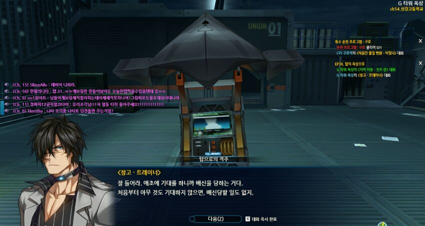

# 보상 중독

::: details This article is migrated from Notion.

- Date: 2022년 3월 5일
- Tags: Thinkings
- Created by: Hyunseung Jeon
- ID: `c4e510ed6f3446ddab64741ea8124c29`
  :::

- **우리는 일을 하며 살아간다.**
  - 여기서 일은 단순한 勞動만을 뜻하는 것이 아니다. 잠이 쏟아져서 커피 한 잔을 내려먹는 것, 휴대폰 배터리가 없어서 충전기에 꽂아놓는 것, 회사에 출근하는 것, 근로소득의 일부를 기부하는 것, 모두 어떠한 '일'을 하는 것이다. 뭐 그렇다고 치자.
- 일을 하고 나면, **가끔은 타인으로부터 인정받고 보상받는다.**
- 문제가 되는 부분은 '가끔은' 인정받는다는 것이다. '항상'이 아니다.

---

- 당신이 한 일에 대해 **충분히 인정받지 못할 수 있다. 충분히 보상받지 못할 수 있다. 인정받고 보상받는 것은 그저 부수적인 요소일 뿐이다.**
- 반대로 생각해보자. **보상이 주어지지 않는 일은 하지 않을 셈인가?**

---

- 자신의 뇌가 보상에 중독된 것은 아닌지 점검해볼 필요가 있다.
- 일의 이유는 보상이 아닌 다른 곳에서 찾는 것이 좋다.
- 계속해서 생각하자.
  - 스스로 생각하기에 이 일을 하는 것이 옳은가?
  - 목적이 명확한가?
  - 인정받지 못하더라도, 보상이 주어지지 않더라도, 그래도 정말 이 일을 하는 것만으로 만족하는가?
  - 타인으로부터의 인정, 또는 보상을 바라고 이 일을 하는 것은 아닌가?

---

- 원래 글 제목은 "인생은 동화가 아니다"였다. 너무 추상적이라 바꿨다.
